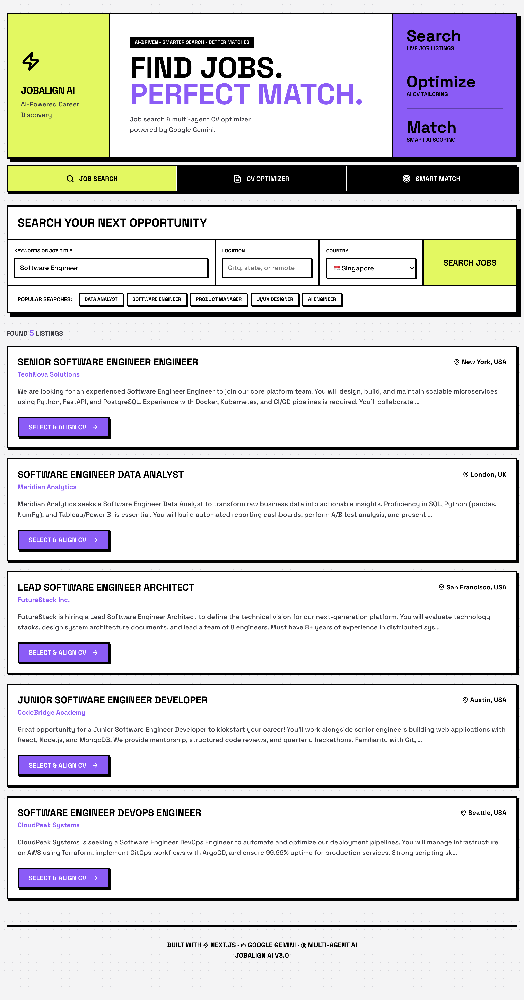
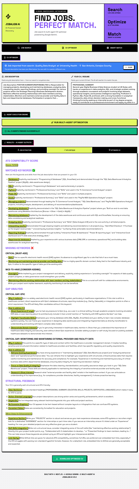
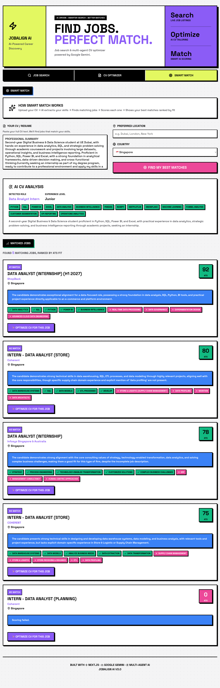
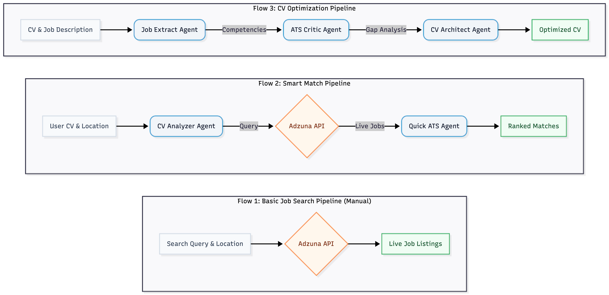

# JobAlign AI

[](https://nextjs.org/)
[](https://react.dev/)
[](https://www.python.org/)
[](https://google.github.io/adk-docs/)
[](https://deepmind.google/technologies/gemini/)
[](https://developer.adzuna.com/)

> *An AI-driven career discovery platform that intelligently matches candidates to their perfect roles and dynamically optimizes their CVs using Multi-Agent LLM workflows.*

**JobAlign AI** is a comprehensive, AI-powered web application designed to revolutionize the job search process. By combining live job market data with the reasoning capabilities of Google Gemini, JobAlign acts as a personal career strategist—finding relevant jobs, scoring your match probability, and tailoring your resume to bypass ATS (Applicant Tracking Systems) filters.

---

* [Demo](#-demo)
* [Project Overview](#-project-overview)
* [Agent Architecture](#-agent-architecture)
* [Tech Stack](#-tech-stack)
* [Quickstart](#-quickstart)
* [Repository Structure](#-repository-structure)
* [Environment Variables](#-environment-variables)
* [Acknowledgements](#-acknowledgements)

---

## 📸 Demo

### 🔍 Live Job Search & CV Optimizer


### 🧠 Smart Match


### Screenshots
*Here are some screenshots showcasing the application in action:*

<table>
  <tr>
    <td valign="top" width="33%"><a href="assets/screenshot-1.png"></a></td>
    <td valign="top" width="33%"><a href="assets/screenshot-2.png"></a></td>
    <td valign="top" width="33%"><a href="assets/screenshot-3.png"></a></td>
  </tr>
</table>

---

## 🚀 Project Overview
Traditional job hunting is broken—candidates send out hundreds of generic CVs into the void, hoping to bypass automated ATS filters. 

**JobAlign AI** solves this by orchestrating a pipeline of specialized AI agents. While the core AI agent logic and initial prototyping were developed using **Python and the Google Agent Development Kit (ADK)**, we transitioned to a robust **JavaScript/Next.js** architecture for the production web app. This dual-language approach allowed us to rapidly build the intelligent agents in Python, while ensuring the final product could be hosted easily and seamlessly on Vercel with a beautiful React frontend.

The platform relies on the following automated workflow:
1. **Live Search:** Queries the Adzuna API for real-time, active job listings across the US, UK, and global markets.
2. **Smart Match Analysis:** An AI agent reads the candidate's profile and the job description, outputting a precise match score and identifying skill gaps.
3. **Dynamic CV Optimizer:** A multi-agent workflow takes the original CV and rewrites bullet points, extracts keywords, and highlights relevant experience specifically tailored to the target job description. **Once finished, it presents the user with three clear outputs: the raw Job Extraction, a detailed ATS Score critique, and the final Optimized CV which can be instantly downloaded as a Markdown file.**

---

## 🤖 Agent Architecture



JobAlign utilizes a **Multi-Agent Workflow** under the hood to ensure high-quality CV tailoring and accurate job matching:

| Feature / Agent | Role | Data Source |
|---|---|---|
| 🔍 **Search Engine** | Fetches live job data based on keyword and location | Adzuna API |
| 🧠 **Match Evaluator** | Compares user profile to job requirements to generate a Match Score (%) | Google Gemini |
| ✍️ **CV Tailor** | Re-writes resume bullet points to naturally include missing ATS keywords | Google Gemini |
| 🕵️ **Reviewer Agent** | Ensures the tailored CV remains truthful and doesn't hallucinate skills | Google Gemini |

---

## 🛠️ Tech Stack
| Component | Choice |
|---|---|
| Frontend Framework | Next.js (App Router) & React.js |
| AI Agent Framework | Custom Orchestration (JS) & Google ADK (Python Prototype) |
| Built With AI (Dev) | Gemini 3.1 Pro, Gemini 2.5 Flash, Claude Sonnet 4.6 |
| IDE / Dev Tool | Antigravity IDE |
| LLM Engine (App) | Google Gemini (via `@google/genai` SDK) |
| Job Data API | Adzuna Job Search API |
| Styling | CSS Modules / Custom CSS |
| Deployment | Vercel |

---

## ⚡ Quickstart

**1. Clone the repository**
```bash
git clone https://github.com/Mohd-Shabir5/job-align.git
cd job-align
```

**2. Install dependencies**
```bash
npm install
# or
yarn install
```

**3. Configure your API keys**
Create a `.env.local` file in the root directory:
```bash
touch .env.local
```
*(See the [Environment Variables](#-environment-variables) section below for required keys).*

**4. Run the development server**
```bash
npm run dev
```

Open [http://localhost:3000](http://localhost:3000) in your browser to see the application running.

---

## 📁 Repository Structure

```
job-align/
├── python-prototype/       # Original Python ADK Agent Prototype
├── public/                 # Static assets (images, SVGs)
├── src/
│   ├── app/                # Next.js App Router (Pages & API Routes)
│   │   ├── api/            # Backend API routes (Gemini & Adzuna integrations)
│   │   └── page.js         # Main Application Entry Point
│   ├── components/         # Reusable React UI Components
│   │   ├── CVOptimizer.js  # AI Resume Tailoring UI
│   │   ├── JobSearch.js    # Live Job Search UI
│   │   └── SmartMatch.js   # Match Scoring UI
│   └── lib/                # Core business logic and helpers
│       ├── agentPrompts.js # System prompts for the AI Agents
│       ├── gemini.js       # Google Gemini SDK integration
│       └── jobSearch.js    # Adzuna API client
├── .env.local              # Local environment variables (DO NOT COMMIT)
├── .gitignore              # Git ignore file
└── package.json            # Project dependencies and scripts
```

---

## 🔑 Environment Variables

To run this project locally, you will need to set up the following environment variables in a `.env.local` file:

| Variable | Description |
|---|---|
| `GEMINI_API_KEY` | Your Google Gemini API key from [Google AI Studio](https://aistudio.google.com/) |
| `ADZUNA_APP_ID` | Your App ID from [Adzuna Developer Portal](https://developer.adzuna.com/) |
| `ADZUNA_APP_KEY` | Your App Key from [Adzuna Developer Portal](https://developer.adzuna.com/) |

---

## ⚠️ API Constraints & Rate Limits (Academic Note)
*Note for graders and reviewers:* 
This project currently operates on the **Free Tiers** for both Vercel and Google AI Studio to remain cost-free. 
- **Google Gemini Rate Limit:** The free tier for this specific model (`gemini-2.5-flash`) strictly limits usage to **20 requests per day**.
- Because the CV Optimizer utilizes a sequential 3-agent pipeline, a single optimization triggers 3 rapid API requests. 
- If multiple users evaluate CVs simultaneously, or if a user clicks rapidly, the platform may temporarily hit a `429 Too Many Requests` error. **If this occurs, simply wait 10-15 seconds and try again.**
- For a production deployment, this would be resolved by attaching a billing account to Google AI Studio to lift the RPM (Requests Per Minute) limit.

---

## 🏆 Acknowledgements

Built with cutting-edge AI technologies to bridge the gap between talented professionals and their dream jobs. Inspired by advanced multi-agent research architectures and powered by Next.js and Google Gemini.
